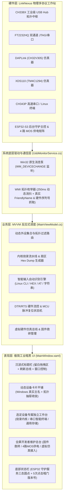

# LinkNexus — 多协议桌面硬件调试站与智能供电管理中枢

<div align="center">

-blue?style=for-the-badge&logo=windows)


-38BDF8?style=for-the-badge)

**专为嵌入式软硬件工程师打造的高工业质感、低视觉噪点、带硬件级安全供电互锁的多协议桌面硬件调试工作台**

[功能规格说明书](README_FUNCTIONAL.md) • [硬件端口重映射指南](README_PortMapping.md) • [快速构建](#-快速构建与运行) • [开发者调试模式](#-开发者调试模式-debug-mode)

</div>

---

## 💡 项目愿景与设计哲学

在现代嵌入式系统与芯片研发中，工程师的桌面上常常堆叠着各种散落的烧录器与调试线（JTAG 调试器、CMSIS-DAP 探针、TI XDS 烧录探针、USB 串口转接模块）。不仅接线杂乱、占用宝贵的上位机 USB 端口，而且传统上位机软件大多界面刺眼、充斥虚假 Mock 数据、模式切换繁琐易错。

**LinkNexus** 专为终结这一混乱现状而生：
- 🚫 **真实 Windows 枚举与完全去噪**：彻底删除一切“端口 #xxx”、“CH通道”、“通道 A/B”等人工编造的前缀标签，卡片主标题**100% 以 Windows 设备管理器识别出来的真实设备名称为主**；未插入设备不占用空间显示卡片。
- 🔍 **智能独立工作页面分发**：
  * **烧录与内核工作台**（FT2232 / XDS110 / DAPLink）：固件拖拽校验 CRC32、芯片架构识别、流式一键烧录、256 字节 Flash 扇区 Hex Dump 转储、整片擦除、CoreID 读取与内核复位；
  * **串口与 Linux CLI 工作台**（CH343P）：纯暗黑工业波特率下拉框、DTR/RTS 硬件引脚控制、CTS/DSR(DTS) 硬件指示、MCU 脉冲复位、智能文本/HEX/Linux CLI/AT 指令自动识别分流引擎及智能双视窗；
  * **通用设备/外部存储工作台**（U盘等外设）：查看 Windows 硬件底层参数。
- 🛡️ **ESP32-S3 后台守护与外设抽屉自动收拢**：
  * ESP32 隐匿于后台运行管理总线，驱动主界面左下角“LinkNexus 物理拓扑守护服务”绿（在线）/ 红（离线）/ 黄（异常）三态，文案去噪，仅展示守护服务状态；
  * ESP32 在线后，自动开启 CH338X 拓扑过滤，仅平铺核心四大引擎，其余通用外设自动收拢入“📂 系统其他设备 (N) ▾”可折叠抽屉中。
- 🛠️ **全屏开发者维护总台与虚拟仿真接入**：
  * 仅限在右下角版本号区域 **1.5 秒内连续点击 5 次**激活，直接切入全屏开发者维护页面；
  * 集成固件一键救砖覆盖（ESP32-S3、TM4C DFU、DAPLink）、4 路 CH338X 物理 MOS 供电控制矩阵及 0xAA 0x55 全双工协议总线；
  * 内置 **虚拟仿真接入功能 (Virtual Simulation Hub)**，一键弹出 4 大核心仿真卡片与全功能独立测试工作台。
- 🎨 **极简工业暗黑美学**：深灰哑光背景（`#18181B`）、沉浸式无边框 WindowChrome、无衬线等宽技术参数阵列，彻底清除所有废话说明。

---

## 🏛️ 系统拓扑与分层架构



---

## ⚡ 核心功能与使用指南

### 1. 动态设备卡片与专属工作台
- 软件启动后通过 Win32 PnP 广播与 WMI 全量枚举硬件，顶部平铺当前连接的设备卡片（标题为 Windows 真实友好名称，拔出即消失）；
- 点击卡片即可在下方展开对应专属工作台：
  * **烧录探针 (FT2232 / XDS110 / DAPLink)**：固件拖拽放入、CRC32 校验、芯片架构识别、扇区 Hex 转储、整片擦除、CoreID 捕获、软复位；
  * **串口与 Linux 终端 (CH343P)**：纯暗黑波特率切换、DTR/RTS/CTS/DSR 硬件引脚控制、一键 MCU 脉冲复位、Linux CLI 快捷命令注入条与智能输入栏；
  * **通用设备 (U盘/外设)**：展示硬件 ID 与实例属性。

### 2. 串口智能输入自动识别与双视窗分流
- **无须频繁切换模式**：输入框自动识别用户意图：
  * 识别到常用 Shell 指令（`uname`、`ifconfig`、`dmesg`、`ls`、`top`、`reboot` 等）$\rightarrow$ 标记 `[🐧 Linux CLI]` 并回车执行；
  * 识别到成对十六进制（如 `01 03 00 00 00 02 C4 0B`）$\rightarrow$ 标记 `[🔢 HEX Frame]` 并以原始二进制帧下发；
  * 识别到 `AT+...` $\rightarrow$ 标记 `[📡 AT Command]`；
  * 其他普通文本 $\rightarrow$ 标记 `[📝 Plain Text]`；
- **智能双视窗**：同时展示 Linux CLI 控制台与串口数据监视器，并支持通过中缝 GridSplitter 自由拖拽视窗宽度。

### 3. 开发者维护模式 (Debug Mode) 与虚拟接入
- **唤醒暗门**：1.5 秒内连续点击右下角版本号 5 次唤醒；
- **专属总台**：全屏切入维护视图，提供固件一键救砖刷入与 4 路 CH338X MOS 供电通断控制；
- **虚拟仿真接入**：点击 `[🚀 开启虚拟硬件接入]`，立即弹出 4 大核心仿真引擎卡片，可无硬件离线验证全部烧录、Hex Dump、串口与 Linux CLI 功能。

---

## 🏷️ 版本号规范体系

LinkNexus 采用严格的工程规范版本号定义：

$$\mathbf{v[XX][xx].[YY][WW]\ (XXX)}$$

| 字段 | 含义 | 说明 | 示例 |
| :---: | :--- | :--- | :---: |
| `XX` | 主版本号 (Major) | 架构级或重大重构主版本 (两位补零) | `01` |
| `xx` | 次版本号 (Minor) | 功能特性迭代或小版本更新 (两位补零) | `00` |
| `YY` | 年份后两位 (Year) | 如 2026 年记为 `26` | `26` |
| `WW` | 自然周数 (Week) | ISO 8601 标准自然周 (01 ~ 53) | `39` |
| `XXX` | 发布阶段代码 | `PRE` (预发布/工程版) / `REL` (正式版) / `RC_` (候选版) | `PRE` |

> 当前基线版本：**`v0100.2639 (PRE)`**

---

## 🚀 快速构建与运行

### 环境准备
- 操作系统：Windows 10 / 11 (x64)
- 运行框架：[.NET 10.0 SDK](https://dotnet.microsoft.com/download/dotnet/10.0) 或更高版本
- IDE 推荐：Visual Studio 2022+ / Visual Studio Code (C# Dev Kit)

### 编译源码
```bash
# 1. 克隆代码仓库
git clone https://github.com/WeiXIngJIaHe/LinkNexus.git
cd LinkNexus

# 2. 还原 NuGet 依赖
dotnet restore LinkNexus/LinkNexus.csproj

# 3. 编译工程 (Release 优化配置)
dotnet build LinkNexus/LinkNexus.csproj -c Release
```

### 一键脚本发布 (Publish.bat)
仓库根目录下提供了自动化打包脚本 [`Publish.bat`](file:///C:/Users/17368/source/repos/LinkNexus/Publish.bat)：
```bat
# 运行自动化发布脚本生成以下两套交付件：
# 1. 框架依赖轻量包 (约 300 KB): Publish_FrameworkDependent/
# 2. 独立自包含免安装运行包 (内置 .NET 运行时，即开即用): Publish_SelfContained/
Publish.bat
```

---

## 📂 工程核心目录结构

```text
LinkNexus/
├── LinkNexus/
│   ├── MainWindow.xaml              # 极简暗黑工业风格主界面布局 (三态卡片流/互锁区/调试台)
│   ├── MainWindow.xaml.cs           # Win32 原生 WndProc 接管、拖拽事件与功能选项卡路由
│   ├── MainViewModel.cs             # MVVM 反应式调度、CRC32 计算、仿真器状态机与命令绑定
│   ├── PortDeviceModel.cs           # 物理端口数据模型 (端口 #1~#4、三态枚举、MOS 开关)
│   ├── UsbMonitorService.cs         # Win32 RegisterDeviceNotification 注册与 WMI 消抖枚举
│   ├── HardwareConfig.cs            # 硬件配置反序列化实体与热重载管理器
│   ├── HardwareConfig.json          # 物理端口拓扑映射、引脚分配与解耦配置文件
│   ├── ProtocolEngine.cs            # ESP32-S3 全双工二进制防粘包协议编解码引擎
│   └── LinkNexus.csproj             # .NET 10.0 WPF 现代化工程定义文件
├── docs/
│   ├── README_FUNCTIONAL.md         # 详细功能规格与界面、监听转发底层技术规范书
│   └── README_PortMapping.md        # PCB 硬件工程师端口映射与跳线适配指南
├── Publish.bat                      # Windows 一键全量编译与双版本发布批处理脚本
└── README.md                        # 本说明文档
```

---

## ⌨️ 常用快捷键与交互一览

| 触发操作 | 目标动作 | 作用说明 |
| :--- | :--- | :--- |
| **连击 5 次版本号** | 激活开发者调试模式 | 1.5 秒内快速点击右下角规范版本号区域 (开启/关闭) |
| **全窗口拖拽文件** | 固件载入与架构识别 | 拖入 `.bin` / `.hex` / `.json` 文件，自动激活调试模式并解析 CRC32 |
| **标题栏刷新按钮** | 强制刷新总线 | 立即触发一次系统全量 Windows PnP 设备树扫描 |

---

## 📄 开源许可证 (License)

本项目基于 [MIT License](LICENSE) 开源。欢迎各类商业与非商业嵌入式开发、测试仪器集成与教学科研使用。
# LinkNexus