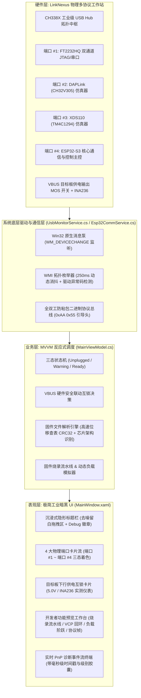

# LinkNexus — 多协议桌面硬件调试站与智能供电管理中枢

<div align="center">

-blue?style=for-the-badge&logo=windows)


-38BDF8?style=for-the-badge)

**专为嵌入式软硬件工程师打造的高工业质感、低视觉噪点、带硬件级安全供电互锁的多协议桌面硬件调试工作台**

[功能规格说明书](README_FUNCTIONAL.md) • [硬件端口重映射指南](README_PortMapping.md) • [快速构建](#-快速构建与运行) • [开发者调试模式](#-开发者调试模式-debug-mode)

</div>

---

## 💡 项目愿景与设计哲学

在现代嵌入式系统与芯片研发中，工程师的桌面上常常堆叠着各种散落的烧录器与调试线（JTAG 调试器、CMSIS-DAP 探针、TI XDS 烧录探针、USB 串口转接模块）。不仅接线杂乱、占用宝贵的上位机 USB 端口，而且传统上位机软件大多界面刺眼、充斥虚假 Mock 数据、缺乏供电保护，极易误触给目标板反向供电甚至击穿芯片。

**LinkNexus** 专为终结这一混乱现状而生：
- 🚫 **彻底剔除工程陈旧概念**：全面废弃内部暗语与“CH通道 / 通道 A / 通道 B”等晦涩称谓，全部以**物理端口序号**（`端口 #1` 至 `端口 #4`）规范排列。
- 🔍 **真实的 USB 枚举与三态着色**：拒绝任何伪造数据，直连 Win32 原生 PnP 消息泵监听真实的硬件 VID/PID 与设备管理器状态（未接入灰暗、异常黄色警告、就绪绿色高亮）。
- 🔒 **下行供电的硬件联动互锁**：VBUS 5.0V 动力输出与“ESP32-S3 核心通信主控”握手状态强绑定；主控未联通或意外掉线时，毫秒级强行阻断供电并锁定控件，杜绝无保护状态下的误加电。
- 🛠️ **隐藏式开发者全功能调试台**：通过工程版本号连击或全局热键呼出，集成**物理端口通断开关**、**固件拖拽与 CRC32 芯片架构智能识别**，以及 **4 大功能预览调试工作台**（烧录流水线、串口回环、负载阶跃、协议帧校验）。
- 🎨 **极简工业暗黑美学**：深灰哑光背景（`#18181B`）、沉浸式无边框 WindowChrome、无衬线等宽技术参数阵列，彻底清除所有废话说明，让硬件状态与控制开关成为唯一核心。

---

## 🏛️ 系统拓扑与分层架构



---

## ⚡ 核心特性一览

### 1. 物理端口矩阵与真实三态指示
拒绝虚假模拟，系统通过 Windows PnP 原生广播精准判定设备状态：
- **状态 A（Unplugged - 灰色压暗）**：未插入设备，卡片不显示乱码伪数据，参数标注为 `--`。
- **状态 B（Warning - 黄色警告）**：插入物理设备但驱动缺失（Code 28）、无法启动（Code 10）或硬件故障（Code 43），卡片淡黄高亮并清晰标注异常原因。
- **状态 C（Ready - 绿色就绪）**：驱动与端口枚举完毕，点亮就绪指示灯，显示真实 COM 口号与硬件序列号。

| 端口序号 | 目标引擎 | 芯片架构 | 硬件协议栈能力 | 默认目标 VID/PID |
| :---: | :--- | :--- | :--- | :--- |
| **端口 #1** | **FT2232HQ 双通道调试器** | FTDI FT2232HQ | MPSSE JTAG/SWD 协议栈 + 高速虚拟串口 (VCP) | `0403:6010` / `0403:6014` |
| **端口 #2** | **DAPLink 仿真器** | WCH CH32V305 (RISC-V) | ARM CMSIS-DAP v2 硬件仿真链路 + 隔离串口 | `0D28:0204` / `1A86:7523` |
| **端口 #3** | **XDS110 仿真器** | TI TM4C1294 (Cortex-M4) | TI 专用隔离烧录探针 + CJTAG/SWD 调试口 | `0451:BEF3` / `0451:BEF2` |
| **端口 #4** | **ESP32-S3 核心主控** | Espressif ESP32-S3 | 全双工协议总线 + INA236 采样 + VBUS 供电联锁 | `303A:1001` / `303A:0002` |

### 2. VBUS 目标板下行供电硬件联动互锁
- 界面左下角设“目标板下行供电输出 (VBUS)”总开关与实时电压/电流双精度采样仪表。
- **硬性保护逻辑**：仅当“ESP32-S3 主控”正常在线且握手成功后，开关控件方可点击；未连通或意外断开时，供电控制区**强制置灰锁定**，并在 1ms 内硬切断下行 MOS 管通路。

---

## 🛠️ 开发者调试模式 (Debug Mode)

日常使用时保持界面极致简洁，但在研发、打样测试或产线维修时，可随时唤醒**开发者调试模式**：

### 1. 唤醒暗门途径
1. **暗门 5 次连击**：1.5 秒内连续点击右下角版本号（如 `v0100.2639 (PRE)`）5 次；
2. **全局快捷键**：按下键盘 <kbd>F12</kbd> 快速切入/退出；
3. **标题栏调试徽章**：点击标题栏右上角的 `[DEBUG 模式]` 胶囊切换；
4. **外部文件拖拽直达**：拖拽任意固件镜像文件至主窗口，系统自动唤醒并激活解析控制台。

### 2. 物理端口开关与三态插拔仿真
- 每个端口卡片底部自动展开微型调试条：
  * **`[端口开启 / 关断]`**：物理切断对应通道 MOS 供电与链路信号，状态置灰离线；
  * **`[模拟插拔]`**：在 `Unplugged` $\rightarrow$ `Ready` $\rightarrow$ `Warning` 之间循环演进，用于验证界面容错与告警样式；
  * **联锁动态传导**：关断端口 #4，可即刻观察到下行 VBUS 供电被强制闭锁。

### 3. 固件/配置文件拖拽放入与智能解析
- 支持拖入 `.bin`、`.hex`、`.elf`、`.json` 文件或点击“浏览放入文件...”；
- **毫秒级 CRC32 计算**：基于纯位移查表算法，极速计算并展示散列值（如 `0x9B41E280`）；
- **智能内核架构检测**：
  * `ARM Cortex-M4F (STM32F4xx)`
  * `Espressif Xtensa LX7 (ESP32-S3)`
  * `TI Stellaris/Tiva (TM4C1294)`
  * `WCH QingKe RISC-V (CH32V305)`
  * `LinkNexus CH338X 拓扑配置文件`

### 4. 4 大开发者功能预览调试工作台
在控制台右侧可自由切换：
1. **固件烧录流水线预览**：一键模拟 SWD 10MHz 握手挂起内核 $\rightarrow$ 扇区快速擦除 $\rightarrow$ 218 KB/s 高速流式写入 $\rightarrow$ 片上硬件 CRC32 比对 $\rightarrow$ 软复位启动目标板全流程。
2. **虚拟串口回环测试 (VCP Loopback)**：输入 AT 指令（如 `AT+SYSINFO?`、`AT+VERSION?`、`PING`），自发自收回环响应，实时统计 TX/RX 累计字节。
3. **VBUS 动态负载阶跃仿真**：提供 0mA、150mA、500mA、1200mA、2000mA 5 级阶跃按钮，基于 $80\text{m}\Omega$ 等效内阻实时计算母线瞬态压降（5.03V 跌至 4.87V）。
4. **ESP32 二进制协议帧校验**：动态构造与验证基于 `0xAA 0x55` 引导头的防粘包二进制帧，自动核验 Checksum 累加和及模拟下位机 ACK。

---

## 🏷️ 版本号规范体系

LinkNexus 采用严格的工程规范版本号定义：

$$\mathbf{v[XX][xx].[YY][WW]\ (XXX)}$$

| 字段 | 含义 | 说明 | 示例 |
| :---: | :--- | :--- | :---: |
| `XX` | 主版本号 (Major) | 架构级或重大重构主版本 (两位补零) | `01` |
| `xx` | 次版本号 (Minor) | 功能特性迭代或小版本更新 (两位补零) | `00` |
| `YY` | 年份后两位 (Year) | 如 2026 年记为 `26` | `26` |
| `WW` | 自然周数 (Week) | ISO 8601 标准自然周 (01 ~ 53) | `39` |
| `XXX` | 发布阶段代码 | `PRE` (预发布/工程版) / `REL` (正式版) / `RC_` (候选版) | `PRE` |

> 当前基线版本：**`v0100.2639 (PRE)`**

---

## 🚀 快速构建与运行

### 环境准备
- 操作系统：Windows 10 / 11 (x64)
- 运行框架：[.NET 10.0 SDK](https://dotnet.microsoft.com/download/dotnet/10.0) 或更高版本
- IDE 推荐：Visual Studio 2022+ / Visual Studio Code (C# Dev Kit)

### 编译源码
```bash
# 1. 克隆代码仓库
git clone https://github.com/WeiXIngJIaHe/LinkNexus.git
cd LinkNexus

# 2. 还原 NuGet 依赖
dotnet restore LinkNexus/LinkNexus.csproj

# 3. 编译工程 (Release 优化配置)
dotnet build LinkNexus/LinkNexus.csproj -c Release
```

### 一键脚本发布 (Publish.bat)
仓库根目录下提供了自动化打包脚本 [`Publish.bat`](file:///C:/Users/17368/source/repos/LinkNexus/Publish.bat)：
```bat
# 运行自动化发布脚本生成以下两套交付件：
# 1. 框架依赖轻量包 (约 300 KB): Publish_FrameworkDependent/
# 2. 独立自包含免安装运行包 (内置 .NET 运行时，即开即用): Publish_SelfContained/
Publish.bat
```

---

## 📂 工程核心目录结构

```text
LinkNexus/
├── LinkNexus/
│   ├── MainWindow.xaml              # 极简暗黑工业风格主界面布局 (三态卡片流/互锁区/调试台)
│   ├── MainWindow.xaml.cs           # Win32 原生 WndProc 接管、拖拽事件与功能选项卡路由
│   ├── MainViewModel.cs             # MVVM 反应式调度、CRC32 计算、仿真器状态机与命令绑定
│   ├── PortDeviceModel.cs           # 物理端口数据模型 (端口 #1~#4、三态枚举、MOS 开关)
│   ├── UsbMonitorService.cs         # Win32 RegisterDeviceNotification 注册与 WMI 消抖枚举
│   ├── HardwareConfig.cs            # 硬件配置反序列化实体与热重载管理器
│   ├── HardwareConfig.json          # 物理端口拓扑映射、引脚分配与解耦配置文件
│   ├── ProtocolEngine.cs            # ESP32-S3 全双工二进制防粘包协议编解码引擎
│   └── LinkNexus.csproj             # .NET 10.0 WPF 现代化工程定义文件
├── docs/
│   ├── README_FUNCTIONAL.md         # 详细功能规格与界面、监听转发底层技术规范书
│   └── README_PortMapping.md        # PCB 硬件工程师端口映射与跳线适配指南
├── Publish.bat                      # Windows 一键全量编译与双版本发布批处理脚本
└── README.md                        # 本说明文档
```

---

## ⌨️ 常用快捷键与交互一览

| 触发操作 | 目标动作 | 作用说明 |
| :--- | :--- | :--- |
| <kbd>F12</kbd> | 切换开发者调试模式 | 全局一键激活/隐藏调试控制条与功能预览工作台 |
| **连击 5 次版本号** | 激活开发者调试模式 | 1.5 秒内快速点击右下角规范版本号区域 |
| **全窗口拖拽文件** | 固件载入与架构识别 | 拖入 `.bin` / `.hex` / `.json` 文件，自动激活调试模式并解析 CRC32 |
| **标题栏刷新按钮** | 强制刷新总线 | 立即触发一次系统全量 Windows PnP 设备树扫描 |

---

## 📄 开源许可证 (License)

本项目基于 [MIT License](LICENSE) 开源。欢迎各类商业与非商业嵌入式开发、测试仪器集成与教学科研使用。
# LinkNexus